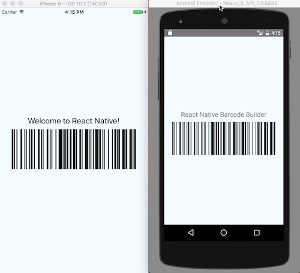

# react-native-barcode-gerar-svg

Componente React Native para gerar código de barras, sem exibir texto/valor,
retorna o PATH para ser adicionado no SVG.

Uses [JsBarcode](https://github.com/lindell/JsBarcode) para codificação de dados.

Uses [@react-native-community/react-native-svg](https://github.com/react-native-community/react-native-svg) em vez de [@react-native-community/art](https://github.com/react-native-community/art).

## Primeiros passos

### Passo 1

Instalação e dependências: `react-native-barcode-gerar-svg`

    npm install react-native-barcode-gerar-svg react-native-svg

### Passo 2

Comece a usar o componente

```javascript
import Barcode from 'react-native-barcode-gerar-svg';

<svg >
   <path d=`${BarcodeGerarSVG({ value: "Olá Mundo", format: "CODE128" })}` />
</svg>;
```

### Formatos suportados:

Você pode encontrar mais informações sobre os formatos de código de barras suportados (por exemplo: CODE128, EAN13, EAN8, UPC, ITF, ...) no: 
[JsBarcode README](https://github.com/lindell/JsBarcode#supported-barcodes)  
[JsBarcode Barcode Generator](https://lindell.me/JsBarcode/generator/)



## Propriedades

<table style="width:80%">
  <tr>
    <th>Propriedade</th>
    <th>Descrição</th>
  </tr>
  <tr>
    <td><code>value</code></td>
    <td>O que significa o código de barras (obrigatório).</td>
  </tr>
  <tr>
    <td><code>format</code></td>
    <td>Qual tipo de código de barras usar (padrão: CODE128). https://github.com/lindell/JsBarcode/blob/master/src/barcodes/index.js</td>
  </tr>
  <tr>
    <td><code>singleBarWidth</code></td>
    <td>Largura de uma única barra (padrão: 2)</td>
  </tr>
  <tr>
    <td><code>height</code></td>
    <td>Altura do código de barras (padrão: 100)</td>
  </tr>
</table>

## Desenvolvedor

[<br><sub>Felipe Silva</sub>](https://github.com/Felipe-S-O) 